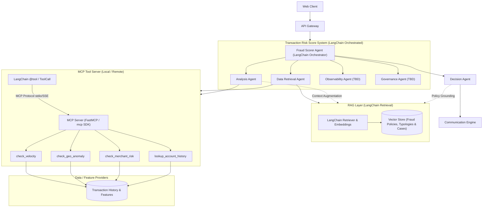

```mermaid
flowchart TB
 subgraph s1["Transaction Risk Score System (LangChain Orchestrated)"]
        n4["Fraud Scorer Agent (LangChain Orchestrator)"]
        n5["Analysis Agent"]
        n6["Data Retrieval Agent"]
        n7["Observability Agent (TBD)"]
        n8["Governance Agent (TBD)"]
  end
 subgraph subGraphRAG["RAG Layer (LangChain Retrieval)"]
        Retriever["LangChain Retriever & Embeddings"]
        VectorDB[("Vector Store (Fraud Policies, Typologies & Cases)")]
  end
 subgraph subGraph1["MCP Tool Server (Local / Remote)"]
        MCPServer["MCP Server (FastMCP / mcp SDK)"]
        ToolCall["LangChain @tool / ToolCall"]
        Tool1["check_velocity"]
        Tool2["check_geo_anomaly"]
        Tool3["check_merchant_risk"]
        Tool4["lookup_account_history"]
  end
 subgraph subGraph2["Data / Feature Providers"]
        MockDB[("Transaction History & Features")]
  end
    n1["Web Client"] --> n2["API Gateway"]
    n2 --> s1
    n4 --> n5 & n6 & n7 & n8 & n9["Decision Agent"]
    ToolCall -- MCP Protocol stdio/SSE --> MCPServer
    MCPServer --> Tool1 & Tool2 & Tool3 & Tool4
    Tool1 --> MockDB
    Tool2 --> MockDB
    Tool3 --> MockDB
    Tool4 --> MockDB
    n5 --> subGraph1
    n6 --> subGraph1
    n6 --> subGraphRAG
    n5 -. Context Augmentation .-> subGraphRAG
    n9 -. Policy Grounding .-> subGraphRAG
    Retriever --> VectorDB
    n9 --> n10["Communication Engine"]

    n1@{ shape: rect}
    n9@{ shape: rect}
```